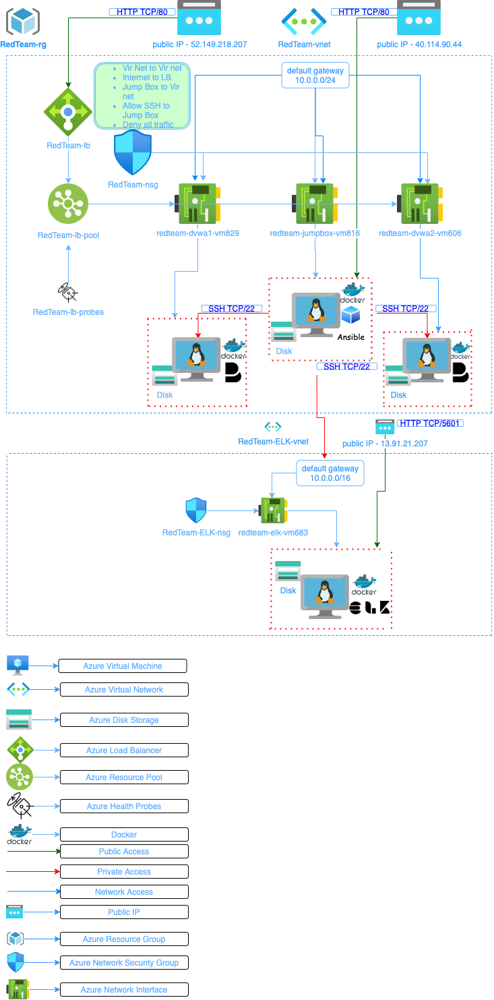

## Automated ELK Stack Deployment

The files in this repository were used to configure the network depicted below.

These files have been tested and used to generate a live ELK deployment on Azure. They can be used to either recreate the entire deployment pictured above. Alternatively, select portions of the filebeat-playbook.yml file may be used to install only certain pieces of it, such as Filebeat.

  - (Ansible/filebeat-playbook.yml)

This document contains the following details:
- Description of the Topology
- Access Policies
- ELK Configuration
  - Beats in Use
  - Machines Being Monitored
- How to Use the Ansible Build

### Description of the Topology

The main purpose of this network is to expose a load-balanced and monitored instance of DVWA, the D*mn Vulnerable Web Application.

Load balancing ensures that the application will be highly available, in addition to restricting within to the network.
- Load balancers prevent direct access to webservers (RedTeam-DVWA1-vm , RedTeam-DVWA2-vm ), the webservers are configured with no public IP/access. Jump box(RedTeam-JumpBox-vm) is configured to deploy configurations to the   webservers using Ansible. Since the webservers running docker containers, it is fully managed via Jump Box using Ansible.

Integrating an ELK server allows users to easily monitor the vulnerable VMs for changes to the logs and system metrics.
- Filebeats collect logs from servers operating system.
- Metricbeat collect metrics from server operting system.

The configuration details of each machine may be found below.

| Name               | Functions              | Private IP Address | Public IP Address              | Operating System |
|--------------------|------------------------|--------------------|--------------------------------|------------------|
| RedTeam-JumpBox-vm | JumpBox to AZ services | 10.0.0.4           | 40.114.90.44                   | Linux/Ubuntu     |
| RedTeam-DVWA1-vm   | WebServer              | 10.0.0.5           | NA                             | Linux/Ubuntu     |
| RedTeam-DVWA2-vm   | WebServer              | 10.0.0.6           | NA                             | Linux/Ubuntu     |
| RedTeam-lb         | Load Balancer          |                    | 52.149.218.207 (RedTeam-lb-IP) | NA               |
| RedTeam-ELK-vm     | Monitoring Server      | 10.1.0.4           | 13.91.21.207                   | Linux/Ubuntu     |

### Access Policies

The machines on the internal network are not exposed to the public Internet. 

Only the JumpBox(RedTeam-JumpBox-vm) machine can accept connections from the Internet. Access to this machine is only allowed from the following IP addresses:
- Jump Box(RedTeam-JumpBox-vm) 40.114.90.44
  - ssh 10.0.0.4
  - ssh 10.0.0.5
  - ssh 10.1.0.4

Machines within the network can only be accessed by Load balancer.
- 52.149.218.207 (RedTeam-lb-IP)

A summary of the access policies in place can be found in the table below.

| Name               | Publicly Accessible | Allowed IP Addresses |
|--------------------|---------------------|----------------------|
| RedTeam-JumpBox-vm | No                  | User IP              |
| RedTeam-lb         | Yes                 | Any                  |
| RedTeam-ELK-vm     | Yes                 | Any                  |
| RedTeam-DVWA1-vm   | No                  | 10.0.0.4             |
| RedTeam-DVWA2-vm   | No                  | 10.0.0.4             |

### Elk Configuration

Ansible was used to automate configuration of the ELK machine.
- ELK server can be managed remotely.
- Deployment is quick with easier maintainance.
- Deployments with virtually no downtime.

The playbook implements the following tasks:
- Install docker.io
- Install python3-pip
- Install docker python module
- Increase virtual memory 
- Download elk image
- Run elk image in a docker container.

The following screenshot displays the result of running `docker ps` after successfully configuring the ELK instance.

### Target Machines & Beats
This ELK server(13.91.21.207) is configured to monitor the following machines:
- 10.0.0.5
- 10.0.0.6

We have installed the following Beats on these machines:
- File Beats
- Metric Beats

These Beats allow us to collect the following information from each machine:
- Filebeats collect logs from servers operating system.
- Metricbeat collect metrics from server operting system.

### Using the Playbook
In order to use the playbook, you will need to have an Ansible control node already configured. Assuming you have such a control node provisioned: 

SSH into the control node and follow the steps below:
- Copy the filebeat-config.yml file to /etc/ansible/files/
- You may also Download filebeat-config.yml using curl                  https://gist.githubusercontent.com/slape/5cc350109583af6cbe577bbcc0710c93/raw/eca603b72586fbe148c11f9c87bf96a63cb25760/Filebeat
- Update the filebeat-config.yml file to include ELK private IP
- Update filebeat-config.yml, metricbeat-config.yml, hosts file. Use ansible hosts file to add hosts, elk host has been used to install ELK on ELK vm , webservers   host has been used to install filebeat on webservers.
- Run the playbook(filebeat-playbook.yml).
- http://[public IP of ELK vm]:5601 to check that the installation worked as expected
